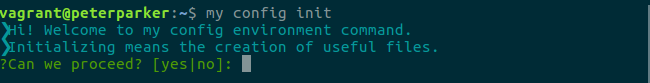

# my config

A set of useful shell script tools to aid in configuring environments.
Works in debian-like distros (ubuntu, etc.) and OSX distros.

## Getting started

For a fast way to run this project, first clone to your local machine.
```
cd ~ && git clone https://github.com/pirpedro/my-config
```

Then run the Makefile
```
cd my-config && sudo make install
```
If everything goes right, execute `my config init` and check the output:


### Prerequisites

The only prerequisite is that you have sudo privileges to execute certains commands.

### Installing

If you want to install the development mode, download the [installer](https://raw.githubusercontent.com/pirpedro/my-config/develop/contrib/installer) script and run it.
```
chmod +x installer && ./installer install develop
```
or in just a single line:
```
curl -L https://raw.githubusercontent.com/pirpedro/my-config/develop/contrib/installer | sudo bash /dev/stdin install develop
```

## Running the tests

If you are interested in running the test suite, see the [test session](docs/tests.cmd).

### Usage

See [command list](docs/commands.md) for more command information.

## Commands
-   [`my config`](docs/config.md) - manage recipes: creation,installation,list, etc.
-   [`my crypt`](docs/crypt.md) - manage creation and encryption of volumes.
-   [`my sync`](docs/sync.md) - keep tracked and syncronized all linked files and folder in a easy way.


## Contributing
1.  Fork it!
2.  Create your feature branch: `git checkout -b my-new-awesome-feature`
3.  Commit your changes: `git commit -am 'Add some awesome feature'`
4.  Push to the branch: `git push origin my-new-awesome-feature`
5.  Submit a pull request and let us see it :smiley:
